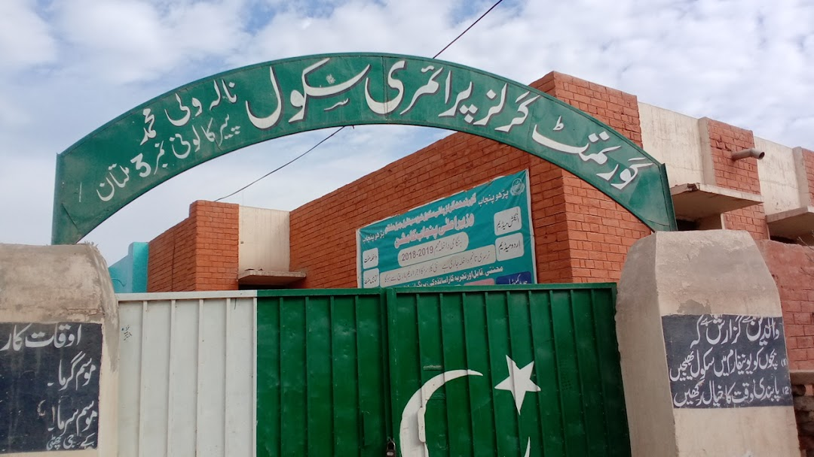
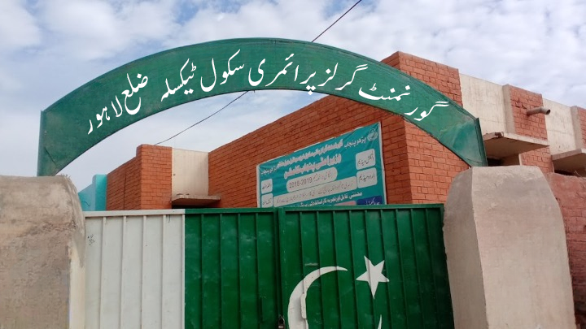

## How does it work
I am asked to get a few dozen images containing texts in a curved form like the image below

My job is to first erase the original text from the image and then add synthetic texts in the same curved form like 

Then I have to build two models

1. A model to detect Urdu text's position in the image
2. A model to recognize that text
  
I am also asked to use multiple fonts for making synthetic images like Naskh, Nastaleek, Naqsh etc

Main task is to generate around half a million synthetic images usig this format

## Helping Repos
[Text Detection Recognition](https://github.com/misbah4064/textDetection-Recognition)

[Object Localization](https://github.com/lars76/object-localization)

## Project Sequence

1. Generate a few hundred synthetic images by hand
2. Look for a way to first detect the text's position in the image frame using some object or text localization model
3. Then get a model for recognition of that text
4. Finally finish generating those 500k images
